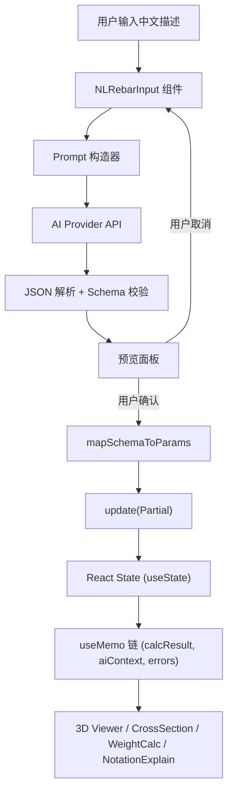
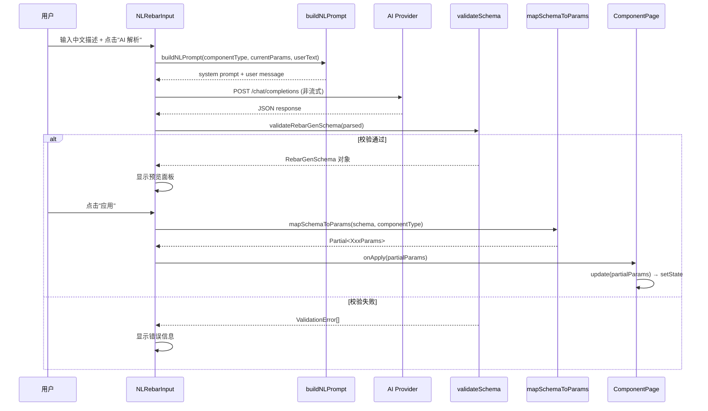

# Design Document: 自然语言配筋输入 (Natural Language Rebar Input)

## Overview

本功能为 RebarViz 的五种构件页面（梁、柱、剪力墙、板、节点）添加自然语言输入能力。用户在参数面板中输入中文配筋描述，系统调用已有 AI 服务商（DeepSeek / 通义千问 / Kimi）将描述解析为结构化 JSON，经过预览确认后回填到表单状态，触发 3D 可视化、截面图、用量估算和标注解读的同步更新。

核心设计思路：引入 **RebarGenSchema** 作为 AI 输出与系统内部参数之间的中间层。AI 只需按语义化的 schema 输出 JSON（使用 `sectionWidth` 而非 `b`，使用 `{ count, grade, diameter }` 而非 `"4C25"`），系统通过 `mapSchemaToParams` / `mapParamsToSchema` 双向映射函数完成格式转换。

## Architecture

### 高层架构



### 组件交互图



### 模块划分

| 模块 | 文件路径 | 职责 |
|------|---------|------|
| RebarGenSchema 类型 | `src/lib/nl-rebar-schema.ts` | 统一中间数据结构定义、JSON Schema 常量 |
| Schema 映射 | `src/lib/nl-rebar-mapper.ts` | `mapSchemaToParams` / `mapParamsToSchema` 双向转换 |
| Prompt 构造 | `src/lib/nl-rebar-prompt.ts` | `buildNLPrompt` 构造 AI 请求、`formatParams` 格式化参数 |
| 解析与校验 | `src/lib/nl-rebar-parser.ts` | `parseAIResponse` JSON 提取、`validateRebarGenSchema` 校验 |
| UI 组件 | `src/components/NLRebarInput.tsx` | 输入框、加载状态、预览面板、确认/取消按钮 |

## Components and Interfaces

### NLRebarInput 组件

```typescript
interface NLRebarInputProps {
  componentType: ComponentType;
  currentParams: BeamParams | ColumnParams | SlabParams | JointParams | ShearWallParams;
  onApply: (partialParams: Partial<any>) => void;
}
```

组件内部状态：

```typescript
// NLRebarInput 内部状态
const [text, setText] = useState('');                           // 用户输入文本
const [loading, setLoading] = useState(false);                  // AI 请求中
const [error, setError] = useState<string | null>(null);        // 错误信息
const [preview, setPreview] = useState<RebarGenSchema | null>(null); // 解析结果预览
const [filledFields, setFilledFields] = useState<string[]>([]);  // 已填充字段列表
```

UI 结构：
1. 多行 `<textarea>` + placeholder（按 componentType 动态切换示例文本）
2. "AI 解析"按钮（loading 时显示 spinner 并禁用）
3. 无 API Key 时显示引导提示（复用 `getApiKeys()` 检测）
4. 预览面板：以中文可读格式展示解析结果 + "应用" / "取消"按钮
5. 成功提示：列出已填充的字段名称
6. 错误提示：具体错误原因（网络错误 / JSON 格式异常 / 字段校验失败）

### 页面集成方式

每个 ComponentPage（如 `ColumnPageClient`）在参数面板的"快速示例"按钮下方嵌入 `<NLRebarInput>`：

```tsx
// ColumnPageClient.tsx 中的集成
<NLRebarInput
  componentType="column"
  currentParams={params}
  onApply={(partial) => update(partial as Partial<ColumnParams>)}
/>
```

`onApply` 直接调用页面已有的 `update()` 函数，该函数通过 `setParams(p => ({ ...p, ...patch }))` 实现部分合并，确保未提及的字段保留原值。由于 `calcResult`、`aiContext`、`errors` 均通过 `useMemo` 依赖 `params`，状态更新后所有派生计算和视图在同一渲染周期内自动重新计算。

### Prompt 构造模块

```typescript
// src/lib/nl-rebar-prompt.ts

/** 构造 AI 解析请求的 system prompt 和 user message */
function buildNLPrompt(
  componentType: ComponentType,
  currentParams: any,
  userText: string
): { system: string; user: string };

/** 将结构化参数格式化为人类可读的中文描述（用于 round-trip 测试） */
function formatParams(componentType: ComponentType, params: any): string;
```

### 解析与校验模块

```typescript
// src/lib/nl-rebar-parser.ts

/** 从 AI 响应文本中提取 JSON 对象（处理 markdown code block 包裹等情况） */
function extractJSON(responseText: string): object;

/** 校验提取的 JSON 是否符合 RebarGenSchema */
function validateRebarGenSchema(
  data: object,
  componentType: ComponentType
): { valid: true; schema: RebarGenSchema } | { valid: false; errors: string[] };

/** 完整解析流程：提取 JSON → 校验 → 返回 RebarGenSchema */
function parseAIResponse(
  responseText: string,
  componentType: ComponentType
): { success: true; schema: RebarGenSchema } | { success: false; error: string };
```

### Schema 映射模块

```typescript
// src/lib/nl-rebar-mapper.ts

/** RebarGenSchema → Partial<XxxParams>（AI 输出 → 系统参数） */
function mapSchemaToParams(
  schema: RebarGenSchema,
  componentType: ComponentType
): Partial<BeamParams | ColumnParams | SlabParams | JointParams | ShearWallParams>;

/** XxxParams → RebarGenSchema（系统参数 → AI 友好格式，用于 round-trip） */
function mapParamsToSchema(
  params: BeamParams | ColumnParams | SlabParams | JointParams | ShearWallParams,
  componentType: ComponentType
): RebarGenSchema;
```
